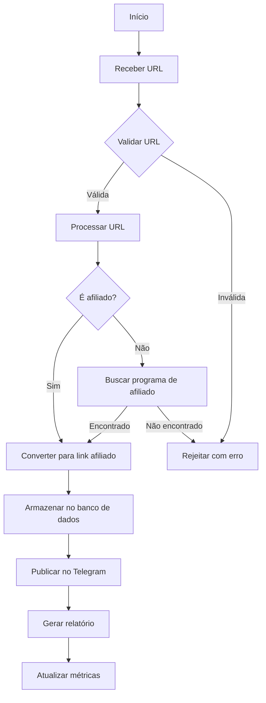

# 📊 Análise Completa do Projeto

## 🔍 Visão Geral do Estado Atual

### ✅ O que já foi implementado:

1. **Estrutura Básica do Projeto**
   - Organização em pacotes Python
   - Configuração de ambiente
   - Sistema de logging
   - Gerenciamento de dependências

2. **Módulo de Afiliados**
   - Integração com múltiplas plataformas (Amazon, AliExpress, Mercado Livre, etc.)
   - Validação de URLs de afiliados
   - Conversão de links
   - Cache de links

3. **Testes**
   - Testes unitários
   - Testes de integração
   - Testes E2E
   - Fixtures para testes

4. **Documentação**
   - README.md
   - CHANGELOG.md
   - Documentação de regras de validação

## 🚧 O que falta para produção:

### 1. Configuração de Produção (Alta Prioridade)
- [ ] Configuração de variáveis de ambiente críticas
- [ ] Configuração de banco de dados em produção
- [ ] Configuração de filas de mensagens
- [ ] Sistema de monitoramento
- [ ] Backup automático

### 2. Segurança (Alta Prioridade)
- [ ] Revisão de permissões
- [ ] Proteção contra abuso
- [ ] Rate limiting
- [ ] Autenticação e autorização
- [ ] Proteção contra injeção SQL

### 3. Otimização (Média Prioridade)
- [ ] Cache de respostas
- [ ] Otimização de consultas
- [ ] Balanceamento de carga
- [ ] Otimização de imagens
- [ ] Compressão de dados

### 4. Recursos Adicionais (Baixa Prioridade)
- [ ] Painel administrativo
- [ ] API REST
- [ ] Documentação da API
- [ ] Sistema de notificações
- [ ] Relatórios avançados

## 📂 Estrutura do Projeto

```
Sistema de Recomendações de Ofertas Telegram2.0/
├── .github/                    # Configurações do GitHub
├── _archive/                   # Código antigo
├── apis/                       # APIs de terceiros
├── apps/                       # Aplicações
├── config/                     # Arquivos de configuração
│   ├── .env.example            # Exemplo de variáveis de ambiente
│   └── settings.py             # Configurações principais
├── data/                       # Dados do sistema
├── docs/                       # Documentação
├── image_cache/                # Cache de imagens
├── models/                     # Modelos de IA
├── reports/                    # Relatórios gerados
├── scripts/                    # Scripts úteis
├── src/                        # Código-fonte principal
│   ├── affiliate/              # Lógica de afiliados
│   │   ├── aliexpress.py       # Integração AliExpress
│   │   ├── amazon.py           # Integração Amazon
│   │   ├── awin.py             # Integração Awin
│   │   └── ...                 # Outras integrações
│   ├── core/                   # Lógica central
│   │   ├── models.py           # Modelos de dados
│   │   ├── services.py         # Serviços principais
│   │   └── utils.py            # Utilitários
│   └── telegram_bot/           # Bot do Telegram
│       ├── bot.py              # Lógica principal do bot
│       └── handlers/           # Handlers de comandos
└── tests/                      # Testes
    ├── e2e/                    # Testes de ponta a ponta
    └── unit/                   # Testes unitários
```

## 🔄 Fluxograma do Sistema



## 🚀 Plano de Ação para Lançamento

### 1. Configuração de Produção (1-2 dias)
- [ ] Configurar variáveis de ambiente
- [ ] Configurar banco de dados em produção
- [ ] Configurar filas de mensagens

### 2. Automação (2-3 dias)
- [ ] Criar scripts de deploy
- [ ] Configurar monitoramento
- [ ] Implementar backup automático

### 3. Segurança (1-2 dias)
- [ ] Revisar permissões
- [ ] Implementar proteção contra abuso
- [ ] Configurar rate limiting

### 4. Otimização (2-3 dias)
- [ ] Implementar cache
- [ ] Otimizar consultas
- [ ] Configurar balanceamento de carga

### 5. Testes Finais (1-2 dias)
- [ ] Testes de carga
- [ ] Testes de segurança
- [ ] Testes de usabilidade

## 💰 Como Começar a Ganhar Dinheiro

1. **Cadastro nos Programas de Afiliados**
   - Amazon Associates
   - AliExpress Affiliate
   - Mercado Livre Afiliados
   - Outras plataformas suportadas

2. **Configuração Inicial**
   - Inserir credenciais de API
   - Configurar canais de divulgação
   - Definir estratégia de preços

3. **Lançamento**
   - Iniciar com tráfego controlado
   - Monitorar conversões
   - Ajustar estratégia conforme necessário

## 📈 Próximos Passos Recomendados

1. **Imediato** (1ª semana)
   - Completar configuração de produção
   - Fazer deploy em ambiente de teste
   - Realizar testes finais

2. **Curto Prazo** (1 mês)
   - Lançar versão beta para usuários selecionados
   - Coletar feedback
   - Ajustar funcionalidades

3. **Médio Prazo** (3 meses)
   - Expandir para mais plataformas
   - Implementar recursos avançados
   - Otimizar taxas de conversão

4. **Longo Prazo** (6+ meses)
   - Automatizar processos
   - Expandir para novos mercados
   - Implementar aprendizado de máquina
